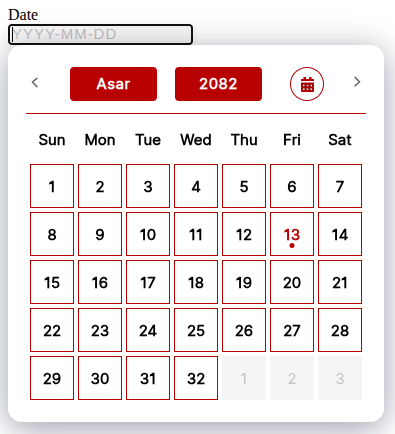

# Nepali Date Selector (Bikram Sambat) - React.js Component

> Nepali Date Selector (Bikram Sambat) as a ReactJS component

[](https://www.npmjs.com/package/nepali-date-selector)
[](https://standardjs.com)

## [Demo](https://iamdurlove.github.io/nepali-date-selector/)



## Install

```bash
npm install --save nepali-date-selector

or,

yarn add nepali-date-selector
```

## Usage

#### For Typescript

```tsx
import { useState } from "react"
import { NepaliDateSelector } from "nepali-date-selector"
import "nepali-date-selector/dist/index.css"

const App = () => {
    const [date, setDate] = useState<string>("")

    return (
        <form>
            <label htmlFor='date'>Date</label>
            <NepaliDateSelector
                inputClassName='form-control'
                className=''
                value={date}
                onChange={(value: string) => setDate(value)}
                options={{ calenderLocale: "ne", valueLocale: "en" }}
            />
        </form>
    )
}

export default App
```

#### For JavaScript

```jsx
import React, { useState } from "react"
import { NepaliDateSelector } from "nepali-date-selector"
import "nepali-date-selector/dist/index.css"

const App = () => {
    const [date, setDate] = useState("")

    return (
        <form>
            <label htmlFor='date'>Date</label>
            <NepaliDateSelector
                inputClassName='form-control'
                className=''
                value={date}
                onChange={(value) => setDate(value)}
                options={{ calenderLocale: "ne", valueLocale: "en" }}
            />
        </form>
    )
}

export default App
```

## License

MIT © [https://github.com/iamdurlove](https://github.com/iamdurlove)

---

# 📖 Documentation

## Features

- Bikram Sambat (BS) Nepali calendar support
- Fully localizable (Nepali/English)
- Keyboard and mouse navigation
- Customizable year and month range
- Typeable and searchable year input
- Accessible and responsive design
- Zero dependencies except React and Nepali date libraries

## API Reference

### `<NepaliDateSelector />` Props

| Prop             | Type       | Default | Description                                                     |
| ---------------- | ---------- | ------- | --------------------------------------------------------------- |
| `value`          | `string`   | `""`    | The selected date in `YYYY-MM-DD` format (BS).                  |
| `onChange`       | `function` | `-`     | Callback when the date changes. Receives the new date string.   |
| `onSelect`       | `function` | `-`     | Callback when a date is selected. Receives the new date string. |
| `className`      | `string`   | `""`    | Custom class for the root wrapper.                              |
| `inputClassName` | `string`   | `""`    | Custom class for the input field.                               |
| `options`        | `object`   | `{}`    | Calendar options (see below).                                   |
| `minYear`        | `number`   | `1970`  | Minimum year selectable.                                        |
| `maxYear`        | `number`   | `2100`  | Maximum year selectable.                                        |
| `todayIfEmpty`   | `boolean`  | `false` | If true, sets today as default when value is empty.             |

#### `options` object

| Option           | Type    | Default | Description                                  |
| ---------------- | ------- | ------- | -------------------------------------------- |
| `closeOnSelect`  | boolean | `true`  | Close calendar after selecting a date.       |
| `calenderLocale` | string  | `"ne"`  | Calendar language: `"ne"` (Nepali) or `"en"` |
| `valueLocale`    | string  | `"en"`  | Output value language: `"ne"` or `"en"`      |

### Example

```tsx
<NepaliDateSelector
    value={date}
    onChange={setDate}
    options={{
        calenderLocale: "en",
        valueLocale: "en",
        closeOnSelect: true,
    }}
    minYear={2000}
    maxYear={2090}
/>
```

## Customization

### Styling

- The component uses [SCSS](src/NepaliDateSelector.scss) for styling.
- You can override styles by importing your own CSS after the default one.
- Main class: `.nepali-date-selector`
- Calendar popup: `.calender`
- Controller: `.calendar-controller`
- Year/month controls: `.control.year`, `.control.month`

### Localization

- Supports Nepali and English out of the box.
- Use the `options.calenderLocale` and `options.valueLocale` props to control language.

### Year/Month Range

- Use `minYear` and `maxYear` props to restrict selectable years.
- The year selector supports both dropdown and manual typing.

## Accessibility

- Keyboard navigation is supported for input and dropdowns.
- All interactive elements are accessible via tab and arrow keys.

## Development

### Scripts

| Command       | Description                     |
| ------------- | ------------------------------- |
| `yarn start`  | Start development build (watch) |
| `yarn build`  | Build for production            |
| `yarn test`   | Run all tests                   |
| `yarn lint`   | Lint TypeScript and SCSS        |
| `yarn format` | Format code with Prettier       |
| `yarn clean`  | Remove build artifacts          |

### Project Structure

```
src/
  NepaliDateSelector/
    Calender/           # Calendar logic and UI
    Config/             # Context and config
    DropDown/           # Dropdown component
    Icons/              # SVG icons
    Locale/             # Localization
    Utils/              # Utility functions
    NepaliDateSelector.tsx
    Types.ts
    index.tsx
  index.tsx             # Entry point
  NepaliDateSelector.scss
```

## Contributing

1. Fork the repository
2. Create your feature branch (`git checkout -b feature/my-feature`)
3. Commit your changes (`git commit -am 'Add new feature'`)
4. Push to the branch (`git push origin feature/my-feature`)
5. Create a new Pull Request

### Code Style

- Follows [StandardJS](https://standardjs.com/) and Prettier
- Lint and format before submitting PRs

## License

MIT © [https://github.com/iamdurlove](https://github.com/iamdurlove/nepali-date-selector)

---

**For more details, see the [demo](https://iamdurlove.github.io/nepali-date-selector/) or the [source code](https://github.com/iamdurlove/nepali-date-selector).**
